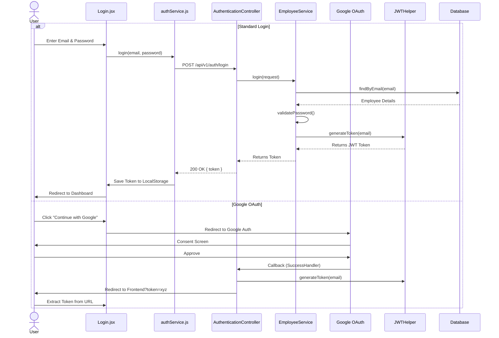
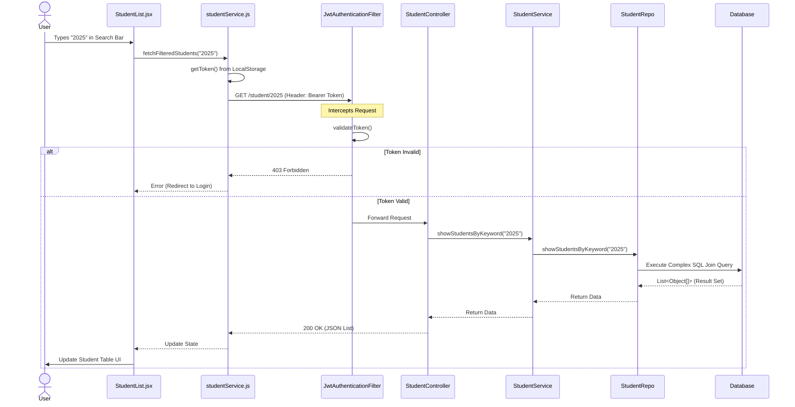
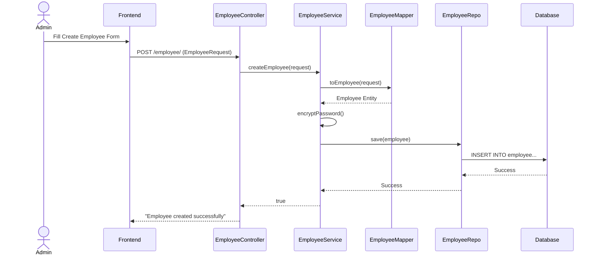

# Project Documentation & Flow Diagrams

This document provides a detailed explanation of every key file in the application and visualizes the core process flows.

## 1. Backend File Descriptions (`src/main/java/com/nir/esd_final_project`)

### **Configuration & Entry Point**
*   **`EsdFinalProjectApplication.java`**: The main entry point of the Spring Boot application. It bootstraps the application.
*   **`config/SecurityConfig.java`**: Configures Spring Security. It defines:
    *   **CORS Policy**: Allows requests from the frontend (localhost:3000).
    *   **CSRF**: Disabled for stateless REST APIs.
    *   **Filter Chain**: Sets up `JwtAuthenticationFilter` to run before the standard authentication filter.
    *   **Public/Private Routes**: Defines which endpoints are public (e.g., `/auth/login`) and which require authentication.

### **Controllers (API Layer)**
*   **`controller/AuthenticationController.java`**: Handles authentication requests.
    *   `login()`: Accepts email/password, validates them, and returns a JWT token.
*   **`controller/EmployeeController.java`**: Manages employee-related operations.
    *   `createEmployee()`: Endpoint to register a new employee (admin/staff).
*   **`controller/StudentController.java`**: Handles student data retrieval.
    *   `showAllStudents()`: Returns a list of all students.
    *   `showStudentsByKeyword()`: Handles search/filtering of students based on a keyword.

### **Services (Business Logic)**
*   **`service/EmployeeService.java`**: Contains business logic for employees.
    *   Handles password encryption during creation.
    *   Validates credentials during login.
    *   Interacts with `EmployeeRepo`.
*   **`service/StudentService.java`**: Contains business logic for students.
    *   Acts as a bridge between the controller and `StudentRepo`.
    *   Handles exceptions like `StudentNotFoundException`.
*   **`service/CustomOAuth2UserService.java`**: Integrates with Spring Security OAuth2 to load user details from Google.

### **Repositories (Data Access)**
*   **`repo/EmployeeRepo.java`**: Interface extending `JpaRepository` for `Employee` entity. Provides methods like `findByEmail`.
*   **`repo/StudentRepo.java`**: Interface extending `JpaRepository` for `Student` entity.
    *   Contains **custom SQL queries** (`@Query`) to fetch detailed student data, joining multiple tables (Student, Placement, Alumni, etc.) for the dashboard view.

### **Entities (Database Models)**
*   **`entity/Student.java`**: Represents the `students` table. Stores personal and academic info.
*   **`entity/Employee.java`**: Represents the `employee` table (system users).
*   **`entity/Placement.java`**: Represents the `placement` table (job drives).
*   **`entity/Organisation.java`**: Represents the `organisation` table (companies).
*   **`entity/Alumni.java`**: Represents the `alumni` table.
*   **`entity/PlacementStudent.java`**: Link table tracking which student applied to which placement.
*   **`entity/PlacementFilter.java`**: Stores eligibility criteria for placements.
*   **`entity/Domains.java`**, **`entity/Specialisation.java`**: Lookup tables for academic programs.

### **Helpers & Utilities**
*   **`helper/Encryption.java`**: Utility for hashing passwords using BCrypt.
*   **`helper/JWTHelper.java`**: Handles **JWT (JSON Web Token)** creation and validation.
    *   `generateToken()`: Creates a signed token with the user's email.
    *   `validateToken()`: Checks if a token is valid and not expired.
*   **`helper/JwtAuthenticationFilter.java`**: A custom filter that intercepts every HTTP request.
    *   Checks for the `Authorization` header.
    *   Validates the JWT token.
    *   Sets the authentication context if the token is valid.
*   **`helper/OAuth2LoginSuccessHandler.java`**: Handles successful Google Login events, generating a JWT and redirecting to the frontend.
*   **`exception/GlobalExceptionHandler.java`**: Centralized error handling. Catches exceptions and returns structured JSON error responses.

---

## 2. Frontend File Descriptions (`src/`)

### **Components (UI)**
*   **`App.js`**: The root component. Sets up **Routing** (React Router) to navigate between Login and Dashboard.
*   **`components/Login.jsx`**: The Login page.
    *   Manages email/password state.
    *   Calls `authService.login()`.
    *   Handles Google OAuth redirection.
*   **`components/StudentList.jsx`**: The main **Dashboard** component.
    *   Displays the table of students.
    *   **Filtering Logic**: Handles client-side filtering (by Year, Org, etc.) and server-side search.
    *   **Stats Calculation**: Computes placement statistics (Avg Package, Top Recruiter) on the fly based on the data.
*   **`components/Navbar.js`**: The top navigation bar.

### **Services (API Integration)**
*   **`services/authService.js`**: Handles HTTP calls for authentication.
    *   `login()`: Sends POST request to backend.
    *   `saveToken()`/`getToken()`: Manages JWT in `localStorage`.
*   **`services/studentService.js`**: Handles HTTP calls for student data.
    *   `fetchFilteredStudents()`: Sends GET request with the JWT token in the header.

### **Hooks**
*   **`hooks/useAuth.js`**: A custom React Hook that provides authentication state (user, login function, logout function) to the rest of the app.

---

## 3. Process Flow Diagrams

### **A. Login Flow (Standard & OAuth)**

This flow shows how a user logs in, either via Email/Password or Google, and receives a JWT token.

### **B. Filter/Search Request Flow**

This flow demonstrates how searching for a student works, involving the JWT token validation and complex database queries.

### **C. Other Requests (e.g., Create Employee)**

A simpler flow for administrative actions.

